# Tool-ArmorPaintMCP

An [MCP](https://modelcontextprotocol.io) server that lets an AI assistant
batch-drive [ArmorPaint](https://armorpaint.org) — re-export existing
projects at different presets, build small procedural materials
(checker/solid node graphs built, rendered, and exported in a single pass),
inspect an existing project's objects, materials, and layers, edit mesh
geometry and UVs (decimate, bevel, subdivide, smooth, duplicate, merge,
unwrap) via ArmorPaint's own real mesh-editing algorithms, and run arbitrary
minic scripts against a project for anything the purpose-built tools don't
cover — without opening the GUI for each pass. Mesh-detail rebaking and
swapping texture sets into an existing project are structurally unreachable
on this ArmorPaint build (no CLI or scripting path exists for either) and
are permanently out of scope — see [STATUS.md](STATUS.md)'s Known Issues for
the specifics.

Full design (including why v1 deliberately did **not** patch ArmorPaint's
source, unlike the reference implementation it started from) is in
[docs/superpowers/specs/2026-09-15-armorpaint-mcp-design.md](docs/superpowers/specs/2026-09-15-armorpaint-mcp-design.md).
That stance was later revised narrowly for the 7 mesh/UV tools below — see
[ROADMAP.md's "Patch policy"](ROADMAP.md#patch-policy) and the design spec's
Amendment 3 for what changed and, just as importantly, what didn't
(rebake/texture-swap remain exactly as out-of-scope as before).

## Status

**Alpha — v1 tool surface + Phase 5 mesh/UV editing tools shipped.** 12
tools total: v1's five (`reexport_project`, `create_procedural_material`,
`list_available_presets`, `inspect_project`, `run_script`) plus Phase 5's
seven mesh/UV editing tools (`decimate_mesh`, `bevel_mesh`, `subdivide_mesh`,
`smooth_mesh`, `duplicate_mesh`, `merge_mesh_geometry`, `unwrap_mesh_uvs`),
all implemented, tested, and gated. See [docs/PLAN.md](docs/PLAN.md) for the
phase plan and [STATUS.md](STATUS.md) for the gate ledger. Live/interactive
"live mode" is deferred, not shipped — see the design spec's "Deferred: live
mode" section.

## Gallery

Real output from `reexport_project`, run against the tracked sample project
(`tests/fixtures/sample_project.arm` — ArmorPaint's own default cube-bevel
primitive + default material, generated headlessly, see
`tests/fixtures/generate_fixture.py`). The fixture is intentionally blank
(no painted layers), so these are flat, single-color swatches, not textured
renders — the point is the real preset-to-preset difference in what gets
exported, not visual richness. Same project, two export presets:

| `generic` preset (separate channels) | `unreal` preset (packed) |
|:--:|:--:|
|  |  |

Real procedural output from `create_procedural_material` — one node graph
built, rendered, and exported in a single ArmorPaint process, on the default
cube-bevel primitive. All four node types below (`"checker"`, `"solid"`,
`"noise"`, `"voronoi"`) are shipped, callable tool inputs, not example-only
imagery — [scripts/generate_gallery.py](scripts/generate_gallery.py)
regenerates all four through the real tool:

| Checker | Solid |
|:--:|:--:|
| 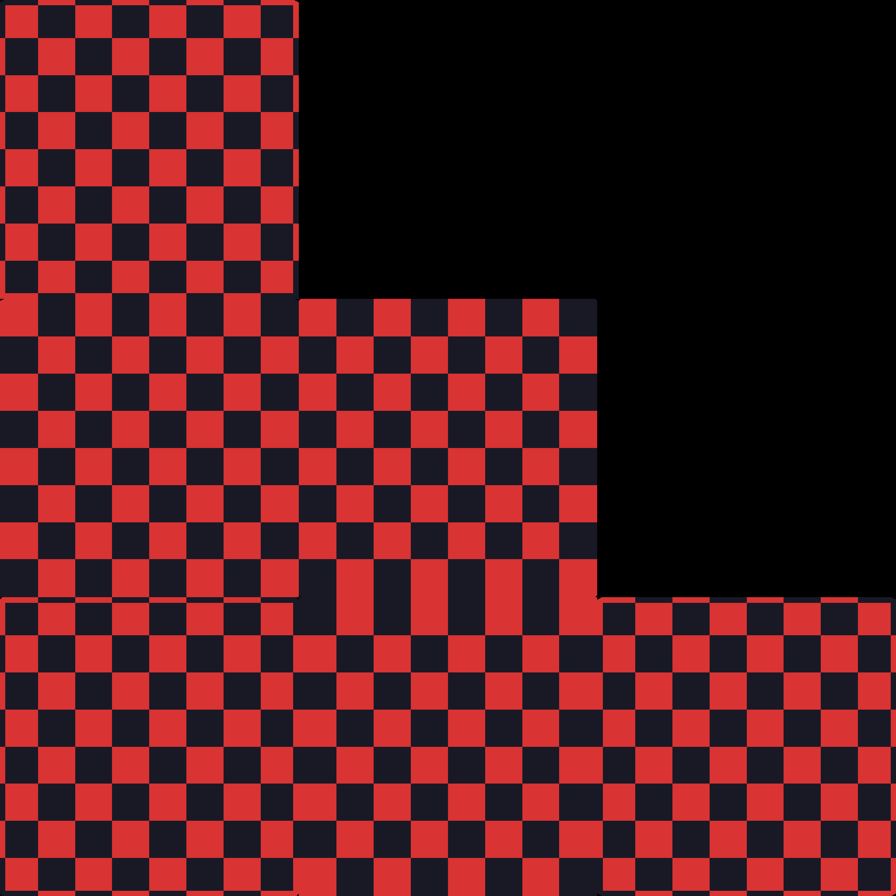 |  |

| Noise | Voronoi |
|:--:|:--:|
| 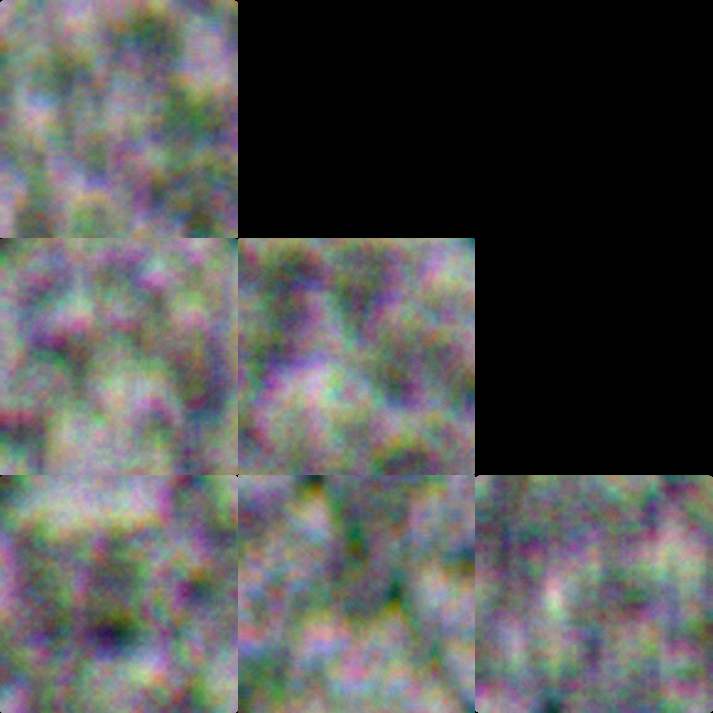 | 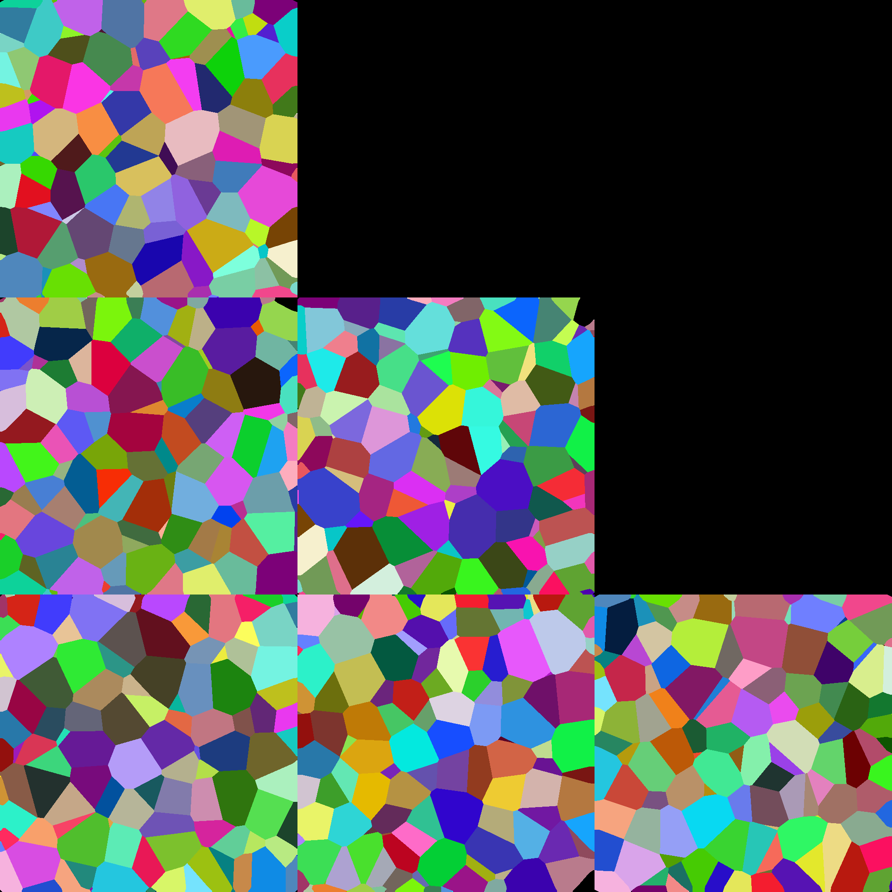 |

ArmorPaint's material-node scripting surface reaches much further than
these four — 62 node types ship in the engine (`paint/sources/nodes_material/`),
and today's `create_procedural_material` can only wire a single node
straight to the output, not compose a real graph. That's the current
ceiling, tracked as open scope, not a platform limit.

Real before/after output from Phase 5's 7 mesh/UV editing tools, each
verified numerically in `tests/` (vertex/face-count diffs against an
independent OBJ export) and, here, shown visually for the first time.
Wireframe-over-solid renders via Blender headless, not ArmorPaint itself —
ArmorPaint has no capability to render a picture of a mesh, headless or
GUI, in this build (see
[docs/superpowers/specs/2026-09-17-mesh-uv-visual-gallery-design.md](docs/superpowers/specs/2026-09-17-mesh-uv-visual-gallery-design.md)).
[scripts/generate_mesh_gallery.py](scripts/generate_mesh_gallery.py)
regenerates all 14 images through the real shipped tools.

| `decimate_mesh` — before | `decimate_mesh` — after |
|:--:|:--:|
| 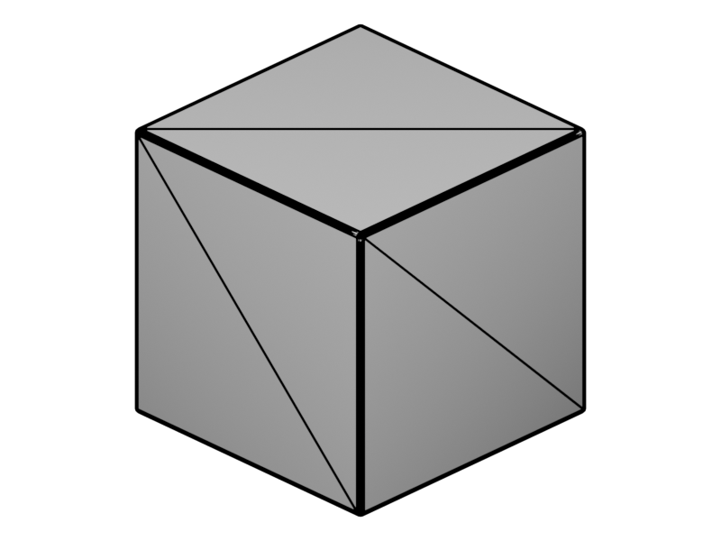 | 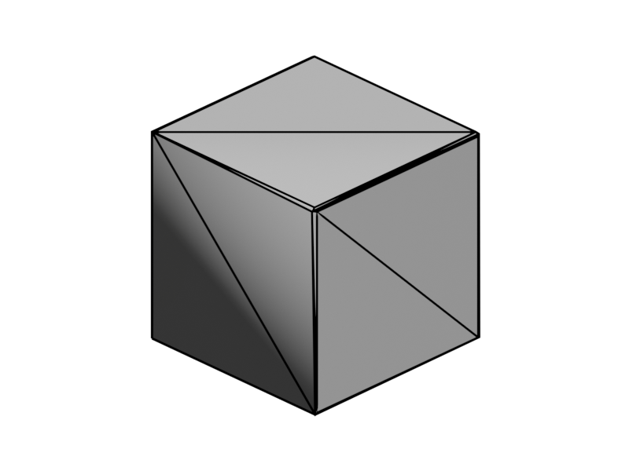 |

*`decimate_mesh` genuinely reduces vertex/face count (verified in `tests/test_decimate_mesh_integration.py`), but that reduction isn't visually obvious in this wireframe render — investigating why is folded into the same follow-up as `smooth_mesh`'s flakiness (see [STATUS.md](STATUS.md) Known Issue #4).*

| `bevel_mesh` — before | `bevel_mesh` — after |
|:--:|:--:|
| 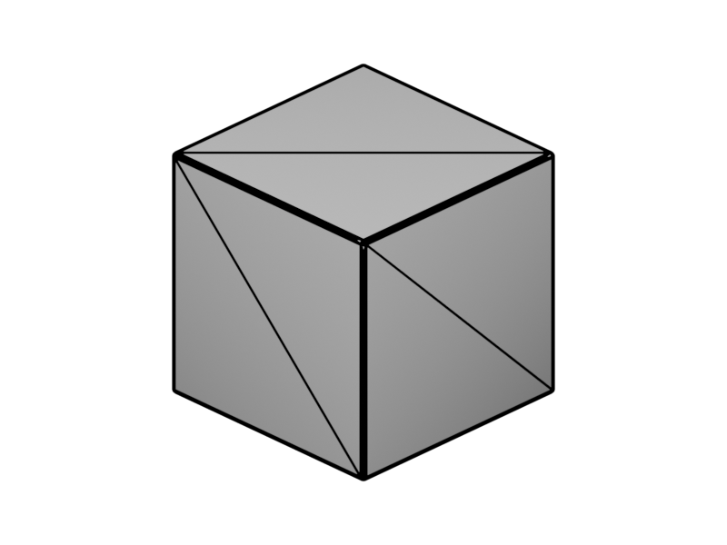 | 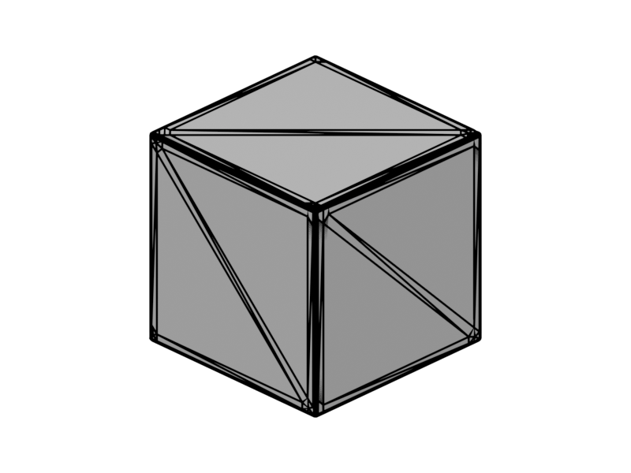 |

| `subdivide_mesh` — before | `subdivide_mesh` — after |
|:--:|:--:|
|  | 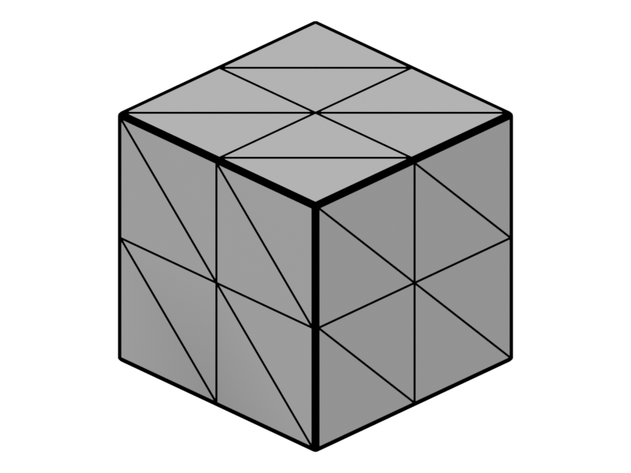 |

| `smooth_mesh` — before | `smooth_mesh` — after |
|:--:|:--:|
| 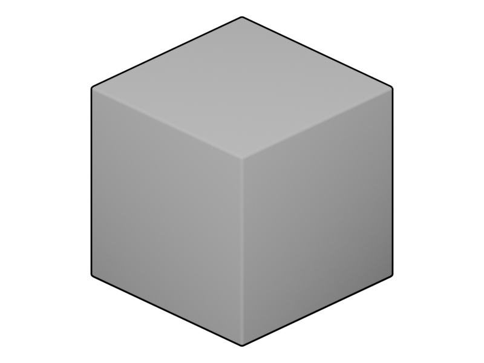 | 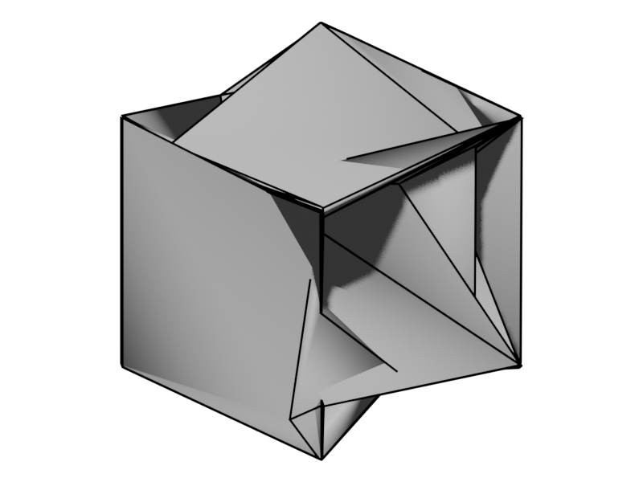 |

*`smooth_mesh` genuinely preserves position here (normals change, not the wireframe) — but be aware this tool is flaky: repeated calls against the identical fixture returned varying vertex counts and, on several runs, degenerate near-zero vertex positions, not just the "changed normals" its own docstring claims. This pair is a verified-clean sample, not proof the tool is reliable — see [STATUS.md](STATUS.md) Known Issue #4.*

| `duplicate_mesh` — before | `duplicate_mesh` — after |
|:--:|:--:|
|  | 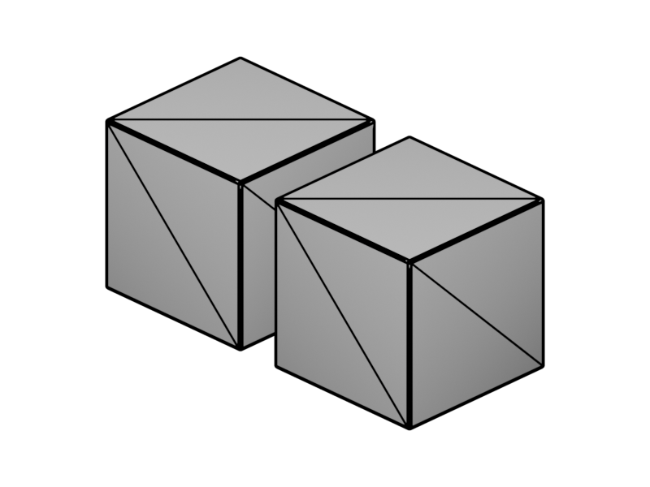 |

| `merge_mesh_geometry` — before | `merge_mesh_geometry` — after |
|:--:|:--:|
|  |  |

| `unwrap_mesh_uvs` — before | `unwrap_mesh_uvs` — after |
|:--:|:--:|
|  |  |

*`unwrap_mesh_uvs` only rewrites UV texture coordinates — vertex positions and topology never change, so this pair is intentionally identical in a 3D wireframe render. Verified instead by real UV-coordinate diffs in [`tests/test_unwrap_mesh_uvs_integration.py`](tests/test_unwrap_mesh_uvs_integration.py).*

## How it works

ArmorPaint ships real CLI automation:
`--background` (headless), `--export-textures/--export-mesh/--export-material`
(native batch export), `--script <path>` (runs a script against the opened
project), and `--api` (prints the full scripting API reference). v1's five
tools drive those directly against a **stock** ArmorPaint binary — no source
patching, no custom rebuild.

The escape-hatch tool, `run_script`, hands the caller's own minic source
straight to `--script` against an already-open project — for the cases the
purpose-built tools don't cover.

The 7 mesh/UV editing tools (`decimate_mesh`, `bevel_mesh`, `subdivide_mesh`,
`smooth_mesh`, `duplicate_mesh`, `merge_mesh_geometry`, `unwrap_mesh_uvs`)
are different: ArmorPaint 1.0's mesh-editing algorithms are real and working
but wired to GUI buttons only, not registered in its minic scripting engine.
These 7 tools require `AP_BINARY` to point at a build carrying a small,
scoped local patch that registers those existing functions for `--script`
use (one line per function — see [ROADMAP.md's "Patch policy"](ROADMAP.md#patch-policy)
for the mechanism and rationale). Run `ap-mcp --check` to confirm your
`AP_BINARY` carries it; v1's five tools work fine against a stock binary
regardless.

## Requirements

- **Python 3.10+** (developed on 3.13)
- **Windows** is the only platform this targets for now.
- An **ArmorPaint build** on disk. Clone `armory3d/armorpaint` (`main`,
  `--recurse-submodules`), run `base\make.bat` from `paint\`, then build
  `ArmorPaint.vcxproj` (Release/x64; needs the VS2022 "C++ Clang Compiler for
  Windows" component, `Microsoft.VisualStudio.Component.VC.Llvm.Clang`, not
  part of the default C++ workload).
  - **Build gotcha:** MSBuild drops `ArmorPaint.exe` in
    `paint\build\x64\Release\`, but it needs `paint\build\out\data\` (the
    asset/shader export from `make.bat`) next to it or it access-violates on
    launch with zero log output. Copy the exe into `paint\build\out\` and
    run it from there.
- **Mesh/UV editing tools need a patched build, additionally.** 7 of the 12
  shipped tools (`decimate_mesh`, `bevel_mesh`, `subdivide_mesh`,
  `smooth_mesh`, `duplicate_mesh`, `merge_mesh_geometry`, `unwrap_mesh_uvs` --
  the Phase 5 tools) require `AP_BINARY` to point at a build of the same
  checkout carrying this project's scoped local minic patch (branch
  `spike/minic-decimate` -- see [ROADMAP.md's "Patch
  policy"](ROADMAP.md#patch-policy) for the branch, mechanism, and current
  state). **That branch is currently unpushed/local-only**, so reproducing
  the full working setup on a fresh machine means building that branch, not
  just `main`. `ap-mcp --check` reports a clear "mesh-edit patch" failure if
  the connected `AP_BINARY` is running stock ArmorPaint -- v1's other five
  tools work fine against a stock binary regardless.

## Install

```bash
git clone https://github.com/graysonchalmers/Tool-ArmorPaintMCP.git
cd Tool-ArmorPaintMCP
python -m venv .venv
# Windows:  .\.venv\Scripts\activate
pip install -e .
cp .env.example .env
```

Then edit `.env`:

```
AP_BINARY=C:\path\to\ArmorPaint\paint\build\out\ArmorPaint.exe
AP_OUTPUT_DIR=C:\path\to\output
```

## Check your setup

```bash
ap-mcp --check
```

Prints a green/red checklist (binary path, data dir alongside it, output dir
writable) and exits non-zero if anything's missing. `ap-mcp --version` prints
the version.

## Verify

```powershell
pwsh smoke/smoke.ps1
```

Headless proof the project is alive: package imports, `--version` and
`--help` exit 0, and 10 of the 12 shipped tools (`reexport_project`,
`inspect_project`, `run_script`, and the 7 mesh/UV editing tools) each have
their own MCP-registration probe -- 13 probes total (3 base + those 10).
`create_procedural_material` and `list_available_presets` are exercised by
the unit/integration tests but don't have their own smoke probe yet. Each
phase adds a probe here.

```bash
pytest -q                # unit tests (fast, no ArmorPaint process)
pytest -q -m integration # the real one: launches ArmorPaint, needs AP_BINARY
```

The integration test is deselected by default (`addopts` in `pyproject.toml`),
so `pytest -q` never launches a GUI; `-m integration` on the command line
replaces that default and runs only the real one.

## Connect it to an MCP client

The server speaks MCP over stdio, on PATH as `ap-mcp` once installed.

```json
{
  "mcpServers": {
    "armorpaint": {
      "command": "ap-mcp",
      "env": {
        "AP_BINARY": "C:\\path\\to\\ArmorPaint\\paint\\build\\out\\ArmorPaint.exe",
        "AP_OUTPUT_DIR": "C:\\path\\to\\output"
      }
    }
  }
}
```

## License

MIT (see [LICENSE](LICENSE)). ArmorPaint retains its own license; this
project drives a separate ArmorPaint build and does not modify or
redistribute its source.
